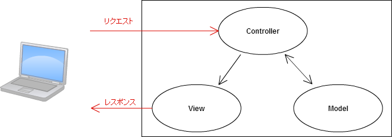

# STEP2-5.フレームワークとは

フレームワーク（アプリケーションフレームワーク）とは、プログラム開発で共通して使用されるであろう標準的な機能を再利用可能な形でまとめたものです。特にWeb開発で用いられるフレームワークではデータベースアクセス、セッション管理、入力チェックなど、今までの講座で扱ったようなものが簡単に記述できるような機能が提供されることが多く、フレームワークをうまく使うことで開発スピードが上がったり、セキュリティが向上したりします。

今回はCakePHPというフレームワークを使用します。CakePHPはMVCアーキテクチャを採用しています。MVCアーキテクチャとは、プログラムをModel（モデル）、View（ビュー）、Controller（コントローラ）の3つに分割して設計・記述することで、プログラムを分かりやすく、拡張性が高いものにするという構造です。モデルはデータの管理・処理を、ビューはHTMLの出力を、コントローラはユーザ入力の処理やモデル・ビューの制御を担当します。

CakePHPの他に有名なフレームワークとしてはZend FrameworkやSymfonyなどがありますが、いずれもMVCアーキテクチャを採用しています。CakePHPを選んだ理由は、日本で最も使用されているからです。

それではCakePHPをインストールしてみましょう。[CakePHP](http://cakephp.jp/)から安定版をダウンロードします。zipファイルを解凍し、フォルダごとhtdocsに置き、適当にフォルダ名を変更します。（cakephpに変更したものとして話を進めます。）Webブラウザから[http://localhost/cakephp/](http://localhost/cakephp/)にアクセスしてみるとCakePHPの初期ページが表示されるはずです。いくつかエラーが表示されていると思います。/app/Config/core.phpを開いてSecurity.saltとSecurity.cipherSeedを適当な値に変更しておきましょう。これらは今まで説明したようにハッシュ化や暗号化をより解析されにくくするための値ですが、初期値のままにしておくとsaltの意味を成さないので変更する必要があります。

# 規約
CakePHPでは細かく命名規則などの規約が定められています。これは、規約を統一することによって多人数での開発の際にコードを統一し、大規模開発をしやすくするためです。

以下は複数の単語からなる語の表し方です。

* キャメル記法：単語ごとに、1文字目を大文字にする記法
 * アッパーキャメルケース(UCC)の例：GetDatas
 * ローワーキャメルケース(LCC)の例：getDatas
* スネーク記法：単語の区切りをアンダースコア(_)で表す記法
 * 例：get_datas

CakePHPでは使用箇所に応じて上記3つの記法が混在して使用されています。

* クラス名はUCC、変数名・関数名はLCC、定数は全て大文字のスネーク記法とする。
* privateやprotectedなメソッドはアンダースコア(_)ではじめる。
* ファイル名はクラス名と同じにする。
* コントローラ名は複数形でUCCで最後にControllerを付ける。
 * 例：UserCommentsController
* モデル名は単数形でUCCに、データベース名は複数形でスネーク記法にする。
 * 例：モデル名 UserComment データベース名 user_comments
* ビューファイル名はスネーク記法にする。

詳しくは[CakePHPの規約](http://book.cakephp.org/2.0/ja/getting-started/cakephp-conventions.html)に載っています。また、[コーディング規約](http://book.cakephp.org/2.0/ja/contributing/cakephp-coding-conventions.html)も統一されています。