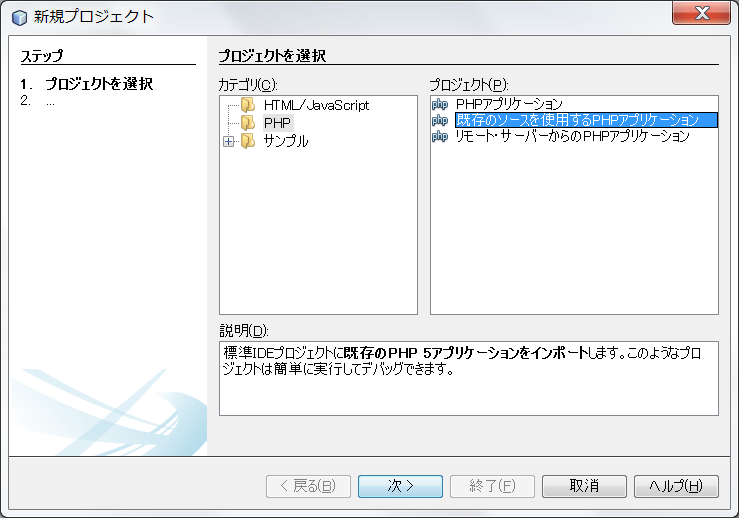
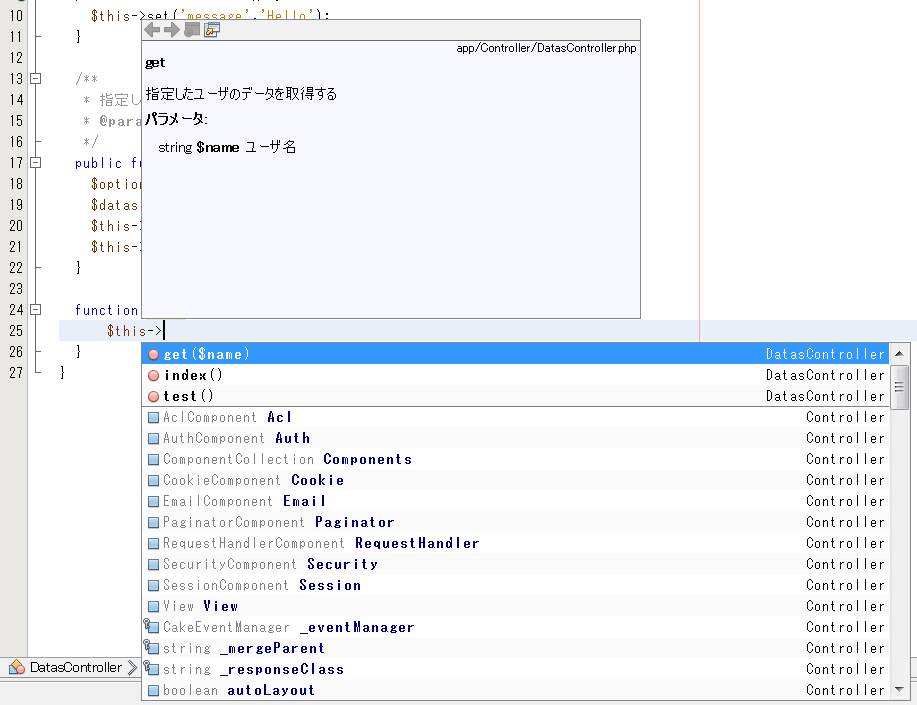
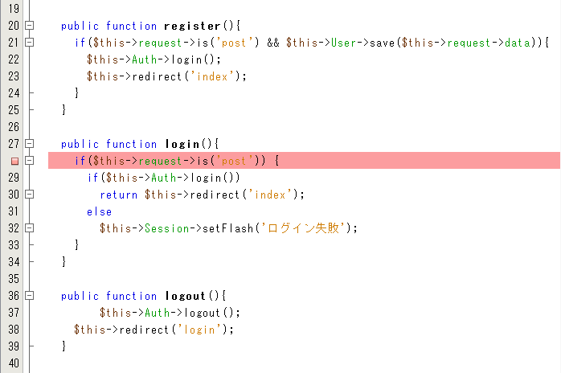

# STEP3-5.IDEを使ってみる

コードを書くには、エディタを使用するかIDEを使用するかという2つの方法があります。IDEとは統合開発環境の略で、コード補完やデバッガをはじめとした、開発が便利になる機能がまとまったものです。エディタはファイル単位での編集操作のみですが、IDEはプロジェクト全体にわたって管理してくれます。ここではNetBeansというCakePHPとの相性がよいIDEの使い方を紹介します。Javaの実行環境をインストールしていない人は[無料Javaのダウンロード](http://java.com/ja/download/)からインストールしておきましょう。

まずは[NetBeans IDE ダウンロード](https://netbeans.org/downloads/)から5種類あるうちのPHP用のNetBeans IDEをダウンロード・インストールします。インストールが終わったら起動してみましょう。

ファイル→新規プロジェクトからプロジェクトを作成します。以下のように[既存のソースを使用するPHPアプリケーション]を選択します。



以上でプロジェクトの作成が完了しました。あとは通常のエディタのように使用できます。ただし、PHPの文法に従って色分け（シンタックスハイライト）してくれたり、PHPの文法上のエラーがあるとエラー箇所と内容をリアルタイムで表示してくれるといった便利な機能があります。

## コード補完
NetBeansにはコード補完機能があり、何か1文字打つと定義した変数や関数の一覧が表示されたり、その際に変数や関数の説明が表示されたりします。これはphpDocumentor形式でコメントを書くことにより変数や関数の説明が表示されるという仕組みです。CakePHPはphpDocumentor形式でコメントが書かれているため、CakePHPの変数や関数も説明が表示されます。

自分で書いたコードにも説明が表示されるようにしてみましょう。以下は前回のDatasController.phpにphpDocumentor形式のコメントを追加したものです。

```php
<?php
App::uses('AppController', 'Controller');

class DatasController extends AppController {

  /**
   * Helloを表示する
   */
  public function index() {
    $this->set('message','Hello');
  }
  
  /**
   * 指定したユーザのデータを取得する
   * @param string $name ユーザ名
   */
  public function get($name){
    $options = array('conditions' => array('name' => $name));
    $datas = $this->Data->find('all', $options);
    $this->set('datas', $datas);
    $this->set('name', $name);
  }
}
```

これによって以下のように関数の説明が表示されるようになりました。



## デバッガ
前回デバッグツールのXdebugをインストールしました。NetBeansではこれを利用してデバッグを行うことができます。php.iniの下部に以下のような行があるので先頭のセミコロンを削除してコメントアウトを外し、xdebug.remote_enableだけ0になっているので1に変更し、Apacheを再起動します。

```
xdebug.remote_enable = 1
xdebug.remote_handler = "dbgp"
xdebug.remote_host = "127.0.0.1"
xdebug.trace_output_dir = "C:\xampp\tmp"
xdebug.remote_port = 9000
```

次にNetBeansでメニューバーよりツール→オプション→PHP→デバッグを選択し、「最初の行で停止」のチェックを外します。更にファイル→プロジェクトプロパティ→実行構成の開始ファイルをapp/webroot/index.phpに設定します。これで準備が整いました。

行番号の部分をクリックすると以下のようにその行が赤くなります。これはブレークポイントといって、実行がこの行で一時停止するようになります。



この状態でメニューバーよりデバッグ→プロジェクトをデバッグを選択するとブラウザが起動します。実行が先ほど設定したブレークポイントの部分になるとIDEの下部に変数の内容や呼出しスタックなどが表示されます。これらの情報を利用して効率的にデバッグしましょう。